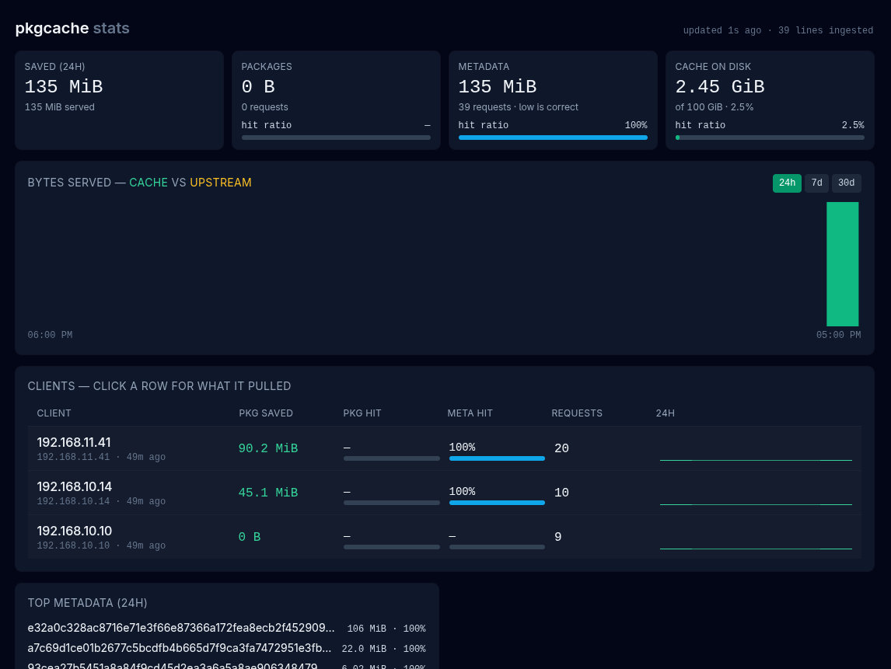

# pkgcache-stats

Reads the proxy's TSV access log, aggregates into SQLite, serves the dashboard.



## Dev loop

**Node 22 is required** — node 24 segfaults during `npm install` on this host
(the same failure qctrl's justfile documents). `.nvmrc` pins it:

```bash
export PATH="$HOME/.nvm/versions/node/v22.20.0/bin:$PATH"

cd frontend && npm install && npm run build   # MUST run before cargo build
cd .. && cargo test && cargo clippy --all-targets -- -D warnings
```

`cargo build` **fails without `frontend/dist`** — `rust-embed` reads it at
compile time. That is correct (a UI-less binary is not shippable) but the error
is confusing on a fresh clone, hence this note.

For UI work, run the backend and Vite separately; Vite proxies `/api` to :8081:

```bash
PKGCACHE_LOGS=/tmp/pkgcache-test/logs PKGCACHE_DATA=/tmp/x cargo run --release
cd frontend && npm run dev     # http://localhost:5173
```

## Running it

```bash
PKGCACHE_LOGS=… PKGCACHE_DATA=… ./target/release/pkgcache-stats --once   # ingest, print, exit
PKGCACHE_LOGS=… PKGCACHE_DATA=… ./target/release/pkgcache-stats          # tick loop + HTTP
```

`--once` is a permanent debugging asset, not scaffolding: it answers "did the
reader actually see this line?" and it is what makes the awk cross-check
possible.

## Verifying the numbers are right

The strongest check available anywhere in this project — sum the same log two
independent ways and require them to agree **to the byte**:

```bash
LOGS=(/path/to/logs/access-*.log); DB=/path/to/stats.sqlite
awk 'END{print NR}' "${LOGS[@]}"
sqlite3 "$DB" "SELECT value FROM totals WHERE key='lines_ingested'"

awk -F'\t' '{s+=$5} END{print s}' "${LOGS[@]}"
sqlite3 "$DB" "SELECT sum(bytes_hit+bytes_miss+bytes_bypass+bytes_none) FROM agg_hour"
```

Note `$upstream_bytes_received` (field 6) can be a comma/colon-separated list —
see `context/distilled.md`. An awk that treats it as one number will disagree.

## Environment knobs

| Var | Default | |
|---|---|---|
| `PKGCACHE_LOGS` | `/logs` | nginx's TSV logs; **rw**, this service prunes them |
| `PKGCACHE_DATA` | `/data` | own scratch: sqlite, lock, `labels.json` |
| `PKGCACHE_CACHE` | `/cache` | nginx cache, **ro**, size only; empty disables the tile |
| `PKGCACHE_BIND` | `0.0.0.0:8081` | |
| `PKGCACHE_TICK_SECONDS` | `5` | |
| `PKGCACHE_LOG_RETENTION_DAYS` | `3` | |
| `PKGCACHE_DB_RETENTION_DAYS` | `30` | |
| `PKGCACHE_WAL` | `1` | set `0` on NFS/CIFS, where SQLite WAL does not work |

`labels.json` is `{"192.168.10.10": "thinkpad"}`. Hand-edited on purpose — there
is no reverse DNS, because this service makes zero outbound network calls.
